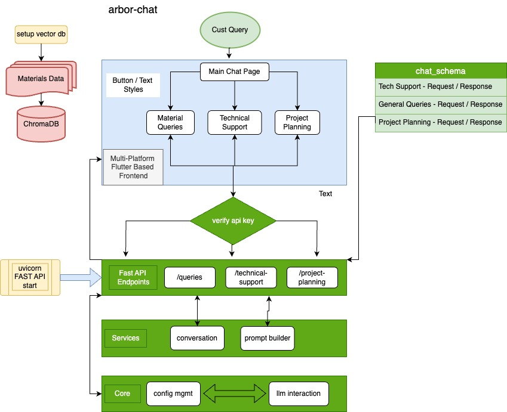

# Arbor Test Project

## Project Overview

An LLM-powered assistant designed for contractors and builders to aid in decision-making regarding building materials.

## Features

- Intelligent Material Queries
- Project Planning Assistant
- Technical Support

## Technologies Used

- **Backend**: FastAPI, LangChain, Chroma
- **Frontend**: Flutter
- **Database**: SQLite (via Chroma)

## Project Structure

```asciidoc
arbor-test/
├── backend/
│   |
│   ├── first_load_vector_db.py
│   ├── main.py
│   ├── api/
│   │   ├── __init__.py
│   │   ├── endpoints/
│   │   │   ├── __init__.py
│   │   │   ├── queries.py
│   │   │   ├── project_planning.py
│   │   │   └── technical_support.py
│   ├── core/
│   │   ├── __init__.py
│   │   ├── config.py
│   │   └── llm.py
│   ├── services/
│   │   ├── __init__.py
│   │   ├── prompt_builder.py
│   │   └── conversation.py
│   ├── schemas/
│   │   ├── __init__.py
│   │   └── chat_schemas.py
│   └── data/
│       ├── __init__.py
│       └── materials_data.py
├──arbor_app/lib/   [Flutter Project Files]
|   ├── pages/
│   │   ├── project_planning.dart
│   │   ├── queries.dart
│   │   ├── technical_support.dart
|   ├── main.dart
|   └── styles.dart
├──requirements.txt    
└── README.md
```

## Project Architecture



### Architecture Overview

The Construction Materials Assistant is designed to provide users with technical support and project planning assistance related to construction materials. The system architecture comprises the following key components:

1. Frontend (Flutter App):

    - Purpose: Provides a user interface for submitting queries and displaying responses.
    - Functionality: Allows users to enter technical support or project planning queries, and displays the assistant's responses.

2. Backend (FastAPI):
    - Purpose: Handles API requests from the frontend and orchestrates the processing of queries.
    - Components:
        - API Endpoints: Defined using FastAPI to receive queries and return responses.
        - Session Management: Manages user sessions to maintain context across multiple interactions.
        - LLM Integration: Interfaces with the language model to generate responses.
        - Vector Store Interaction: Retrieves relevant documents from the vector store using embeddings.

3. Knowledge Base:
    - Stores domain-specific information such as product catalogs, technical documents, building codes, installation guides, safety documents, and material alternatives.
    - Data is organized and stored in a structured format for efficient retrieval.

4. Vector Store (Chroma):
    -  Stores embeddings of the knowledge base documents to facilitate similarity search.
    - Provides fast retrieval of relevant documents based on query embeddings.

5. Language Model (OpenAI's GPT-3.5-turbo via LangChain):
    - Generates human-like responses to user queries.
    - Connected through LangChain's RetrievalQA chain to incorporate retrieved context into responses.

### Data Flow - 


- User Interaction 
    - The user submits a query through the Flutter app.
- API Request 
    - The frontend sends the query to the backend via an HTTP POST request to the appropriate endpoint (/technical-support/ or /project-planning/).
- Session Management 
    - The backend checks for a session ID to maintain context or generates a new one.
- Retrieval Augmented Generation:
    - Retrieval:
        - The query is embedded using OpenAI embeddings.
        - The embedding is used to perform a similarity search in the vector store.
        - Relevant documents are retrieved.
    - Generation:
        - The retrieved documents are provided as context to the LLM.
        - The LLM generates a response that incorporates both the user's query and the contextual information.
- Response Delivery:
    - The generated response, along with any references and the session ID, is returned to the frontend.
    - The frontend displays the response to the user.

### LLM integration details

- Language Model:
    - Model Used: OpenAI's GPT-3.5-turbo.
    - Access Method: Integrated via LangChain's ChatOpenAI class.
    - Integration Framework:

- LangChain: A framework that simplifies the integration of language models with retrieval systems and other utilities.
    - Components Used:
        - ChatOpenAI: Handles communication with OpenAI's GPT models.
        - RetrievalQA Chain: A chain that combines document retrieval and question answering.

### Process Flow:

- Query Embedding:
    - The user's query is converted into an embedding using OpenAIEmbeddings.

- Document Retrieval:
    - The embedding is used to perform a similarity search in Chroma.
    - Relevant documents from the knowledge base are retrieved.

- Response Generation:
    - The retrieved documents are passed as context to the GPT-3.5-turbo model via the RetrievalQA chain.
    - The LLM generates a response that is informed by both the query and the context.

- Result Delivery:
    - The response is returned to the backend, which forwards it to the frontend.

### Prompt Engineering Approach

- Current Strategy:
    - Default Prompts: Currently, the system uses default prompts template.
    - Formatting as plain text without ** for bold text, augmented with query to llm.

## Setup Instructions

Note: First clone the repository, then create the following files and ensure they contain BASE_URL, OPENAI_KEY and API_KEY as mentioned below:

- backend/.env

```bash
API_KEY="secureapikeyforbackend"
OPENAI_KEY="your-openai-api-key"
```

- arbor_app/assets/.env

```bash
API_KEY="secureapikeyforbackend"
OPENAI_KEY="your-openai-api-key"
BASE_URL="http://127.0.0.1:8000"
```

### Backend Setup

1. Create and activate a virtual environment:

   Note: Current setup runs on python@3.12

```bash
python3 -m venv arbor_env
source arbor_env/bin/activate
```

2. Install dependencies:

```bash
pip install -r requirements.txt
```

3. Configure environment variables in `.env` in both arbor_app/assets and backend/
4. Populate the vector database:

```bash
python3 first_load_vector_db.py
```

5. Run the backend server:

```bash
cd backend
uvicorn main:app --reload
```

### Frontend Setup

###### If flutter is not installed use the following link to install

###### https://docs.flutter.dev/get-started/install

1. Navigate to the Flutter project directory:

```bash
cd arbor_app
```

2. Install dependencies:

```bash
flutter pub get
```

3. Run the Flutter app:

```bash
flutter run
```

## API Endpoints

- **POST /queries/**: Submit a natural language query about materials.
- **POST /project-planning/estimate**: Submit a project description to receive material estimates.
- **POST /technical-support/**: Ask technical questions regarding materials, installation, etc.

## API Documentation

After running the api using command -

```bash
uvicorn main:app --reload
```

open the link below

http://127.0.0.1:8000/docs#/

## Testing

Functional testing completed on following queries -

1. How to install lumber? /technical-support
2. How much does lumber cost? /queries
3. How to plan installation of lumber? /project-planning
4. What are the types of lumber available and their stock stituation? /queries
5. Which lumber is better? /queries
6. \<empty> /queries /technical-support /project-planning

Unit testing could not be executed in the allotted time, while as things are working it can be programmed using pytest.

---

Copyright (c) 2024 Surbhit Kumar

All rights reserved.

This work is the property of Surbhit and is protected under copyright law.
Unauthorized copying, distribution, or use of this code, in whole or in part, is strictly prohibited.

For inquiries, contact: me@surbhitkumar.com

```text

```
